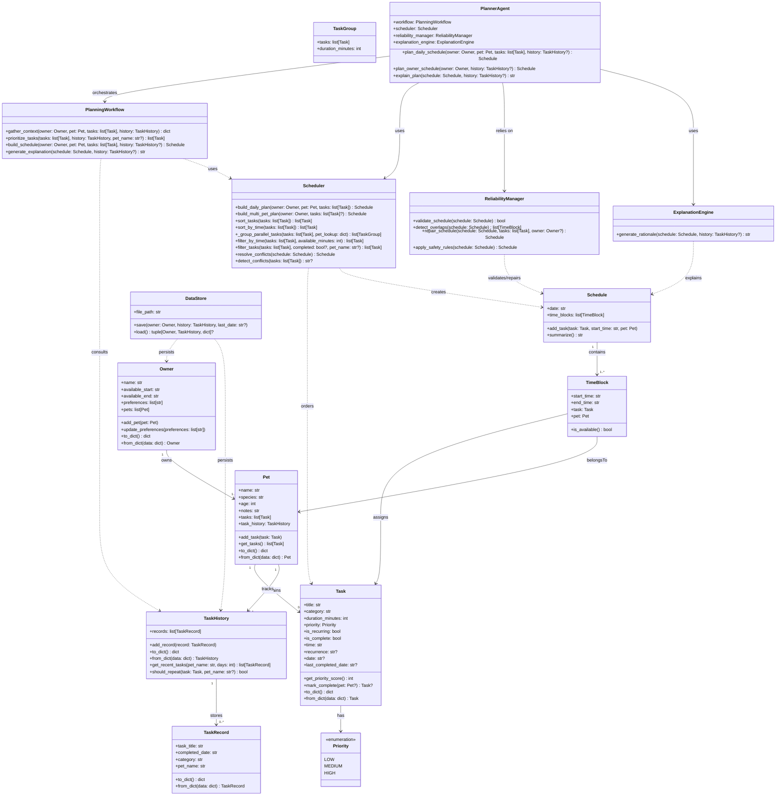

# PawPal+ Project 4: Applied AI System

## Base Project and Its Original Scope

The base project is an application that helps a busy pet owner by helping them track pet care tasks, consider their time constraints and prioritizes certain tasks. The app creates daily plans for the owner so that they may deligate pet tasks.

However there are some limitations to this application. Some limitations being that it does not take into account previous days tasks (so a daily task might include taking the pet a bath which would not be something some one would do daily) In addition, i would like to fix the substantial overlap scheduling that might occur.

## Substantial New AI Feature Added (RAG, Agent, Specialization, or Reliability Mechanism)

For the new AI feature I added a multistep agent/planning workflow with a reliability mechanism.

Note: The AI features (PlannerAgent, PlanningWorkflow, and ReliabilityManager) are implemented locally in `pawpal_system.py` — no external LLM or cloud API is required. This project uses rule-based and agentic logic rather than calling an external AI.

## README clearly explains project goals and new features.

## README contains step-by-step instructions to install, run, and test the system.

Follow these steps to set up, run, and test the PawPal+ system locally.

1. Create and activate a virtual environment

    - macOS / Linux

      ```bash
      python -m venv .venv
      source .venv/bin/activate
      ```

    - Windows (PowerShell)

      ```powershell
      python -m venv .venv
      .\.venv\Scripts\Activate.ps1
      ```

2. Install dependencies

    ```bash
    pip install -r requirements.txt
    ```

3. Run the test suite (verifies scheduling, history, and reliability features)

    ```bash
    python -m pytest
    ```

4. Run the CLI demo (optional)

    ```bash
    python main.py
    ```

5. Run the Streamlit UI

    - Development / local view:

      ```bash
      .venv\Scripts\python.exe -m streamlit run app.py --server.port 8501
      ```

    - If you prefer headless mode (useful for automated environments):

      ```bash
      .venv\Scripts\python.exe -m streamlit run app.py --server.headless true --server.port 8501
      ```

    After starting Streamlit, open http://localhost:8501 in your browser.

Notes:
- The AI-style features (PlannerAgent, PlanningWorkflow, ReliabilityManager) are implemented locally in `pawpal_system.py`. No external LLM or cloud API is required to run the system.
- If your OS shell is `cmd.exe` instead of PowerShell, activate the environment with `.venv\Scripts\activate.bat`.
- If you add or change dependencies, re-run `pip install -r requirements.txt`.

## README includes sample input/output illustrating system behavior.

1. Enter your Name and time available to start and end your tasks. 
    enter time start 08:00 and time end 16:00; Click save owner button
2. Add your pet name and choose your pet species then click add pet
    Ex enter the following:
        Rio | Dog
3. Add pet task, time it is expected to take and the priority of the task click the add task button
    
4. repeat step 3 for all tasks.
    Ex enter the following :
        Morning walk| 60 mins |priority High
        Breakfast| 10 mins |priority High
        Medicine| 5 mins |priority High
        trim nails| 60 mins |priority low
        Grooming| 30 mins| priority medium
        Dinner|10 mins| priority High
5. After finishing adding all tasks if you wish to add another pet add another pet name and species then add tasks, time it is expected and the priority of the task 
    Ex enter the following:
        Luna | Cat
    Ex enter the following tasks:
        Breakfast| 10 mins |priority High
        Grooming| 15 mins |priority Medium
        Play Time| 30 mins| priority Medium
        Dinner| 10 mins| priority High
        Clean Litter|15 mins| priority High
6. Once you have finished entering all pets and tasks click on the generate schedule button.
7. You should have the following results:

08:00 - 09:00 | [high] Afternoon Walk · rio

09:00 - 10:00 | [high] Morning Walk · Rio,

10:00 - 10:20 | [high] Litter Change · luna

10:20 - 10:35 | [high] Clean Litter · Luna

10:35 - 10:45 | [high] Breakfast · Luna, Rio, 

10:45 - 10:55 | [high] Dinner · Luna, Rio,

10:55 - 11:05 | [high] Medicine · rio

11:05 - 11:10 | [high] Medicine · Rio

11:10 - 11:40 | [medium] Grooming · Rio

11:40 - 12:10 | [medium] Play Time · Luna,

12:10 - 12:25 | [medium] Grooming · Luna

12:25 - 13:25 | [low] Nail Trim · Rio

13:25 - 14:10 | [low] Bath · Luna

14:10 - 14:30 | [low] Nail Trim · Rio

8. then click save data. to save the data in the json file

## Mermaid UML Diagram



______________________________________________________________________________________________
# PawPal+ (Module 2 Project) (Unoptimized version)

You are building **PawPal+**, a Streamlit app that helps a pet owner plan care tasks for their pet.

## Scenario

A busy pet owner needs help staying consistent with pet care. They want an assistant that can:

- Track pet care tasks (walks, feeding, meds, enrichment, grooming, etc.)
- Consider constraints (time available, priority, owner preferences)
- Produce a daily plan and explain why it chose that plan

Your job is to design the system first (UML), then implement the logic in Python, then connect it to the Streamlit UI.

## What you will build

Your final app should:

- Let a user enter basic owner + pet info
- Let a user add/edit tasks (duration + priority at minimum)
- Generate a daily schedule/plan based on constraints and priorities
- Display the plan clearly (and ideally explain the reasoning)
- Include tests for the most important scheduling behaviors

## Getting started

### Setup

```bash
python -m venv .venv
source .venv/bin/activate  # Windows: .venv\Scripts\activate
pip install -r requirements.txt
```

## Install, Run, and Test

Follow these steps to set up, run, and test the PawPal+ system locally.

1. Create and activate a virtual environment

    - macOS / Linux

      ```bash
      python -m venv .venv
      source .venv/bin/activate
      ```

    - Windows (PowerShell)

      ```powershell
      python -m venv .venv
      .\.venv\Scripts\Activate.ps1
      ```

2. Install dependencies

    ```bash
    pip install -r requirements.txt
    ```

3. Run the test suite (verifies scheduling, history, and reliability features)

    ```bash
    python -m pytest
    ```

4. Run the CLI demo (optional)

    ```bash
    python main.py
    ```

5. Run the Streamlit UI

    - Development / local view:

      ```bash
      .venv\Scripts\python.exe -m streamlit run app.py --server.port 8501
      ```

    - If you prefer headless mode (useful for automated environments):

      ```bash
      .venv\Scripts\python.exe -m streamlit run app.py --server.headless true --server.port 8501
      ```

    After starting Streamlit, open http://localhost:8501 in your browser.

Notes:
- The AI-style features (PlannerAgent, PlanningWorkflow, ReliabilityManager) are implemented locally in `pawpal_system.py`. No external LLM or cloud API is required to run the system.
- If your OS shell is `cmd.exe` instead of PowerShell, activate the environment with `.venv\Scripts\activate.bat`.
- If you add or change dependencies, re-run `pip install -r requirements.txt`.

### Suggested workflow

1. Read the scenario carefully and identify requirements and edge cases.
        core actions: -add owner, add owner schedule, add pet task prority, add pet, schedule pet tasks, edit pet task priority
2. Draft a UML diagram (classes, attributes, methods, relationships).
3. Convert UML into Python class stubs (no logic yet).
4. Implement scheduling logic in small increments.
5. Add tests to verify key behaviors.
6. Connect your logic to the Streamlit UI in `app.py`.
7. Refine UML so it matches what you actually built.

## 🖥️ Sample Output

Paste a sample of your app's CLI or Streamlit output here so a reader can see what a generated plan looks like:

=============================================
 TODAY'S SCHEDULE FOR CARLENE'S PETS 
=============================================

🐾 Rio (Dog):
  ⏰ 08:00 - 08:15 | [HIGH] Feed Breakfast
  ⏰ 08:15 - 08:30 | [HIGH] Feed Dinner
  ⏰ 08:30 - 09:15 | [MEDIUM] Afternoon Walk
  ⏰ 09:15 - 09:35 | [MEDIUM] Play Time
  ⏰ 09:35 - 10:00 | [LOW] Bath Time

🐾 Lupin (Dog):
  ⏰ 08:00 - 08:15 | [HIGH] Feed Breakfast
  ⏰ 08:15 - 08:30 | [HIGH] Feed Dinner
  ⏰ 08:30 - 09:15 | [MEDIUM] Afternoon Walk
  ⏰ 09:15 - 09:35 | [MEDIUM] Play Time
  ⏰ 09:35 - 10:00 | [LOW] Bath Time

🐾 Coco (Dog):
  ⏰ 08:00 - 08:15 | [HIGH] Feed Breakfast
  ⏰ 08:15 - 08:30 | [HIGH] Feed Dinner
  ⏰ 08:30 - 08:40 | [HIGH] Give Medicine
  ⏰ 08:40 - 09:00 | [MEDIUM] Play Time
  ⏰ 09:00 - 09:25 | [LOW] Bath Time

=============================================

## 🧪 Testing PawPal+

Run the test suite with:

```bash
python -m pytest
```

These tests cover the core scheduling behaviors for PawPal+, including sorting tasks in chronological order, creating the next occurrence for recurring daily tasks, and detecting conflicts when two tasks share the same time. My confidenc level is about a 3.5 stars because so far the tests are like below and the 77% has me worried.

=================================== test session starts ====================================
platform win32 -- Python 3.14.4, pytest-9.1.1, pluggy-1.6.0
rootdir: C:\Users\carle\AI110\ai110-module2show-pawpal-starter
plugins: anyio-4.14.1
collected 9 items                                                                           

tests\test_pawpal_system.py .......                                                   [ 77%]
tests\tests\test_pawpal.py ..                                                         [100%]

==================================== 9 passed in 0.06s =====================================

## 📐 Smarter Scheduling

The scheduler now uses a small set of methods to turn a pet's task list into a practical daily plan.

- Sorting behavior: `Scheduler.sort_tasks()` orders tasks by priority, then duration, and `Scheduler.sort_by_time()` orders them by clock time so the plan can be reviewed chronologically.
- Filtering behavior: `Scheduler.filter_tasks()` can narrow tasks by completion status or by matching a pet name or category keyword, which helps the owner focus on the right tasks.
- Conflict detection logic: `Scheduler.detect_conflicts()` compares tasks in time order and returns a warning when one task would overlap another.
- Recurring task logic: `Task.mark_complete()` marks a task complete and, when the task is marked recurring with a daily or weekly recurrence, creates the next occurrence for the pet.

## 🎬 Demo Walkthrough

PawPal+ provides a simple Streamlit experience for building a pet care routine.

1. The app opens with an owner profile section where a user can enter their name and save it.
2. A user can add one or more pets, choose a species, and then add care tasks such as walks, feeding, medicine, or grooming.
3. Once tasks are added, the app displays them in a table sorted by time and highlights any overlap warnings if two tasks would conflict.
4. The user can generate a daily schedule, which uses the Scheduler to order tasks, respect the owner’s available window, and produce a plan for the selected pet.
5. The workflow is: add a pet → add care tasks → review the sorted task list → generate the daily schedule → view the planned time blocks.

Key Scheduler behaviors shown in the demo include:
- sorting tasks by time for review
- filtering feeding-related tasks for quick focus
- detecting conflicts when tasks overlap
- building a daily schedule based on priority and available time

Example CLI output from running the script in main.py:

```text
=============================================
 TODAY'S SCHEDULE FOR CARLENE'S PETS 
=============================================

🐾 Rio (Dog):
  Unsorted tasks:
    - Bath Time (19:00)
    - Afternoon Walk (16:00)
    - Play Time (14:00)
    - Feed Breakfast (08:00)
    - Feed Dinner (18:00)
  Sorted by time:
    - Feed Breakfast (08:00)
    - Play Time (14:00)
    - Afternoon Walk (16:00)
    - Feed Dinner (18:00)
    - Bath Time (19:00)
  Filtered by pet-name keyword 'feed':
    - Feed Breakfast
    - Feed Dinner
  Scheduled plan:
    ⏰ 08:00 - 08:15 | [HIGH] Feed Breakfast
    ⏰ 08:15 - 08:30 | [HIGH] Feed Dinner
    ⏰ 08:30 - 09:15 | [MEDIUM] Afternoon Walk
=============================================
```
